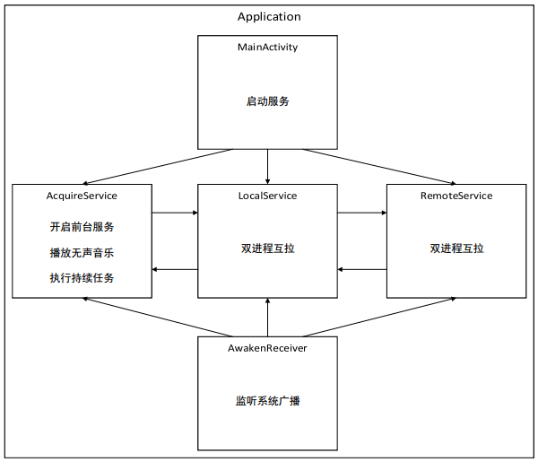

# 【Android系列】一种“靠谱”的进程保活方法

## 写在开头的话
在阅读本文之前，各位读者需要了解到，本文提出的 Android 进程保活方法只是相对“靠谱”，在某些情况下可能无法起效，这些情况包括但不仅限于：

1. 用户主动杀死进程；
2. 使用各种手机管家杀死进程；
3. Android 系统的演进以及国内各大厂商对 Android 系统的定制也会对进程保活有所影响；
4. 其它。

另外还要声明的一点是，本文所介绍的 Android 进程保活方法参考了网上大量的文章，并非作者原创，在本文最后会列出参考的文章链接。

## 背景
目前很多 Android 应用都要求进程在后台常驻，以支持某些持续性（**Continuous**）任务。一个典型的持续性任务是计步应用，例如乐动力和春雨计步器；另一个典型的持续性任务是即时通讯应用，例如QQ和微信。本文提出的进程保活方法虽然比不上这些成熟的应用，但也相对“靠谱”。

目前网上已有的进程保活方法主要有：

- 双进程互拉；
- 一像素大法；
- 加入白名单；
- 监听各种广播；
- 使用前台服务；
- 播放无声音乐；
- 使用各种推送；
- 使用 JobService；
- 长连接和心跳检测；
- 使用 AccountSync；
- 其它。

实际上，这些方法中的一些已经无法起效了，而且这些方法也不能绝对保证应用一直在后台存活。既然无法保证应用一直在后台存活，那么就要在应用被杀死后及时有效地重新唤醒应用。

## 方法
本文介绍的进程保活方法并没有跳出上面列出的方法范围，只是将几种方法有效结合，并在小米6上测试发现能够较为有效的保活进程，整个保活框架如下图所示：



其中：

- MainActivity 负责启动 AcquireService、LocalService 和 RemoteService 三个服务；
- LocalService 和 RemoteService 分别运行在不同进程中，如果 LocalService 被系统杀死，那么 RemoteService 会重新启动 LocalService，反之亦然；
- AcquireService 通过开启前台服务、播放无声音乐以及和 LocalService 进行互相拉取来保活，并且 AcquireService 负责执行持续性任务；
- AwakenReceiver 负责监听系统广播，在接收到广播后，判断本应用是否在运行，如果本应用不在运行，那么启动 AcquireService、LocalService 和 RemoteService 三个服务。

### 双进程互拉
由于涉及到不同的进程，因此读者需要掌握 Android 中进程间通信（IPC）的原理和方法，关于 IPC 的文章网上已经有很多，这里不再赘述。下面依次看下 IDaemonInterface 和 LocalService 的源码：

```java
// IDaemonInterface.aidl

interface IDaemonInterface {
    String getServerName();
    void startServer();
    void stopServer();
    boolean isServerRunning();
}
```

```java
// LocalService.java

public class LocalService extends Service {
    private static final String SERVICE_NAME = 
            LocalService.class.getSimpleName();

    private IBinder localBinder;
    private ServiceConnection remoteConnection;

    // if you would like to keep some services alive,
    // please declare corresponding service connections here
    private ServiceConnection acquireConnection;

    @Override
    public void onCreate() {
        super.onCreate();

        localBinder = new LocalServiceBinder();
        remoteConnection = new RemoteServiceConnection();

        // please assign values to corresponding service connections here
        acquireConnection = new AcquireServiceConnection();
    }

    @Override
    public int onStartCommand(Intent intent, int flags, int startId) {
        super.onStartCommand(intent, flags, startId);
        bindService(new Intent(LocalService.this, RemoteService.class), 
                remoteConnection, Context.BIND_IMPORTANT);

        // please bind corresponding service connections here
        bindService(new Intent(LocalService.this, AcquireService.class), 
                acquireConnection, Context.BIND_IMPORTANT);

        return START_STICKY;
    }

    @Override
    public IBinder onBind(Intent intent) {
        return localBinder;
    }

    private class LocalServiceBinder extends IDaemonInterface.Stub {
        @Override
        public String getServerName() throws RemoteException {
            return SERVICE_NAME;
        }

        @Override
        public void startServer() throws RemoteException {}

        @Override
        public void stopServer() throws RemoteException {}

        @Override
        public boolean isServerRunning() throws RemoteException {
            return true;
        }
    }

    private class RemoteServiceConnection implements ServiceConnection {
        @Override
        public void onServiceConnected(ComponentName name, IBinder service) {
            try {
                IDaemonInterface binder = IDaemonInterface.Stub.asInterface(service);
            } catch (RemoteException e) {
                e.printStackTrace();
            }
        }

        @Override
        public void onServiceDisconnected(ComponentName name) {
            startService(new Intent(LocalService.this, RemoteService.class));
            bindService(new Intent(LocalService.this, RemoteService.class), 
                    remoteConnection, Context.BIND_IMPORTANT);
        }
    }

    private class AcquireServiceConnection implements ServiceConnection {
        @Override
        public void onServiceConnected(ComponentName name, IBinder service) {
            try {
                IDaemonInterface binder = IDaemonInterface.Stub.asInterface(service);
            } catch (RemoteException e) {
                e.printStackTrace();
            }
        }

        @Override
        public void onServiceDisconnected(ComponentName name) {
            startService(new Intent(LocalService.this, AcquireService.class));
            bindService(new Intent(LocalService.this, AcquireService.class), 
                    acquireConnection, Context.BIND_IMPORTANT);
        }
    }
}
```

这里采用了 AIDL 的方式进行进程间通信，在 LocalService 中：

- LocalServiceBinder 类实现了 IDaemonInterface 接口，LocalServiceBinder 对象将作为进程间通信的媒介；
- RemoteServiceConnection 类实现了 ServiceConnection 接口，RemoteServiceConnection 对象负责监听 LocalService 与 RemoteService 间的连接状态，并在连接断开时重新建立连接；
- AcquireServiceConnection 类实现了 ServiceConnection 接口，AcquireServiceConnection 对象负责监听 LocalService 与 AcquireService 间的连接状态，并在连接断开时重新建立连接。

RemoteService 与 LocalService 类似，它们在 AndroidManifest.xml 中的声明如下：

```xml
<!-- AndroidManifest.xml -->

<service
    android:name=".daemon.LocalService"
    android:enabled="true"
    android:exported="true" />
<service
    android:name=".daemon.RemoteService"
    android:enabled="true"
    android:exported="true"
    android:process="com.zzw.squirrel.remote" />
```

可以看到，RemoteService 是运行在一个名为`com.zzw.squirrel.remote`的单独的进程中的，而 LocalService 仍运行在默认的进程中。

### 开启前台服务 & 播放无声音乐
在 AcquireService 中，是通过开启前台服务、播放无声音乐以及和LocalService互拉进行保活的：

```java
// AcquireService.java

public class AcquireService extends Service {
    private static final String SERVICE_NAME = 
            AcquireService.class.getSimpleName();
    private ServiceConnection localConnection;
    public static final int NOTIFICATION_ID = 88;
    private MediaPlayerHelper mediaPlayerHelper;
    private boolean isRunning = false;

    @Override
    public void onCreate() {
        super.onCreate();
        localConnection = new LocalServiceConnection();
        doInitialize();
    }

    @Override
    public int onStartCommand(Intent intent, int flags, int startId) {
        super.onStartCommand(intent, flags, startId);
        bindService(new Intent(AcquireService.this, LocalService.class), 
                localConnection, Context.BIND_IMPORTANT);
        return START_STICKY;
    }

    @Override
    public void onDestroy() {
        super.onDestroy();
        startService(new Intent(getApplicationContext(), AcquireService.class));
    }

    @Override
    public IBinder onBind(Intent intent) {
        return new AcquireServiceBinder();
    }

    private synchronized void doInitialize() {
        mediaPlayerHelper = new MediaPlayerHelper(this);
    }

    private synchronized void doStart() {
        if (isRunning) {
            return;
        } else {
            isRunning = true;
        }

        if (Build.VERSION.SDK_INT >= Build.VERSION_CODES.JELLY_BEAN_MR2) {
            Notification notification = new Notification.Builder(this).
                    setSmallIcon(R.mipmap.ic_launcher).
                    setContentTitle("Squirrel").
                    setContentText("data acquisition running...").
                    build();
            startForeground(NOTIFICATION_ID, notification);
        } else {
            startForeground(NOTIFICATION_ID, new Notification());
        }

        mediaPlayerHelper.start();
    }

    private synchronized void doStop() {
        if (!isRunning) {
            return;
        } else {
            isRunning = false;
        }

        if (Build.VERSION.SDK_INT >= Build.VERSION_CODES.JELLY_BEAN_MR2) {
            NotificationManager manager = (NotificationManager) 
                    getSystemService(NOTIFICATION_SERVICE);
            manager.cancel(NOTIFICATION_ID);
            stopForeground(true);
        }

        mediaPlayerHelper.stop();
    }

    private class AcquireServiceBinder extends IDaemonInterface.Stub {
        @Override
        public String getServerName() throws RemoteException {
            return SERVICE_NAME;
        }

        @Override
        public void startServer() throws RemoteException {
            doStart();
        }

        @Override
        public void stopServer() throws RemoteException {
            doStop();
        }

        @Override
        public boolean isServerRunning() throws RemoteException {
            return isRunning;
        }
    }

    private class LocalServiceConnection implements ServiceConnection {
        @Override
        public void onServiceConnected(ComponentName name, IBinder service) {
            try {
                IDaemonInterface binder = IDaemonInterface.Stub.asInterface(service);
            } catch (RemoteException e) {
                e.printStackTrace();
            }
        }

        @Override
        public void onServiceDisconnected(ComponentName name) {
            startService(new Intent(AcquireService.this, LocalService.class));
            bindService(new Intent(AcquireService.this, LocalService.class), 
                    localConnection, Context.BIND_IMPORTANT);
            startService(new Intent(AcquireService.this, RemoteService.class));
        }
    }
}
```

在 AcquireService 中：

- AcquireServiceBinder 类实现了 IDaemonInterface 接口，AcquireServiceBinder 对象将作为进程间通信的媒介；
- LocalServiceConnection 类实现了 ServiceConnection 接口，LocalServiceConnection 对象负责监听 LocalService 与 AcquireService 间的连接状态，并在连接断开时重新建立连接；
- MediaPlayerHelper 类负责开始/停止播放无声音乐，它的源码如下：

```java
// MediaPlayerHelper.java

public class MediaPlayerHelper {
    private Context context;
    private MediaPlayer mediaPlayer;

    public MediaPlayerHelper(Context context) {
        this.context = context;
    }

    public synchronized void start() {
        if (mediaPlayer == null) {
            mediaPlayer = MediaPlayer.create(context, R.raw.silent);
            mediaPlayer.setLooping(true);
        }
        if (!mediaPlayer.isPlaying()) {
            mediaPlayer.start();
        }
    }

    public synchronized void stop() {
        if (mediaPlayer != null) {
            if (mediaPlayer.isPlaying()) {
                mediaPlayer.stop();
            }
            mediaPlayer.release();
            mediaPlayer = null;
        }
    }
}
```

AcquireService 在 AndroidManifest.xml 中的声明如下：

```xml
<!-- AndroidManifest.xml -->

<service
    android:name=".acquire.AcquireService"
    android:enabled="true"
    android:exported="true"
    android:process="com.zzw.squirrel.acquire" />
```

可以看到，AcquireService 和 LocalService 一样，也是运行在独立的进程中。

### 监听系统广播
除了上面“主动的”进程保活方法之外，以防万一，我们还需要加入“被动的”进程保活方法——监听系统广播。

AwakenReceiver 负责监听开机、安装/卸载应用、解锁、挂载/卸载媒体以及网络变化等系统广播：

```java
// AwakenReceiver.java

public class AwakenReceiver extends BroadcastReceiver {
    @Override
    public void onReceive(Context context, Intent intent) {
        boolean isAlive = false;
        ActivityManager activityManager = (ActivityManager) 
                context.getSystemService(Context.ACTIVITY_SERVICE);
        List<ActivityManager.RunningAppProcessInfo> appProcessInfos = 
                activityManager.getRunningAppProcesses();
        for (ActivityManager.RunningAppProcessInfo appProcessInfo : appProcessInfos) {
            if (appProcessInfo.processName.equals(AppHelper.PACKAGE_NAME)) {
                isAlive = true;
                break;
            }
        }
        if (!isAlive) {
            startServices(context);
        }
    }

    private void startServices(Context context) {
        context.startService(new Intent(context, LocalService.class));
        context.startService(new Intent(context, RemoteService.class));
        context.startService(new Intent(context, AcquireService.class));
    }
}
```

AwakenReceiver 在 AndroidManifest.xml 中的声明如下：

```xml
<!-- AndroidManifest.xml -->

<receiver
    android:name=".daemon.AwakenReceiver"
    android:enabled="true"
    android:exported="true">
    <!-- device reboot broadcast -->
    <intent-filter>
        <action android:name="android.intent.action.BOOT_COMPLETED" />
        <category android:name="android.intent.category.LAUNCHER" />
    </intent-filter>
    <!-- install/uninstall broadcast -->
    <intent-filter>
        <action android:name="android.intent.action.PACKAGE_ADDED" />
        <action android:name="android.intent.action.PACKAGE_REMOVED" />
        <data android:scheme="package" />
    </intent-filter>
    <!-- unlock broadcast -->
    <intent-filter>
        <action android:name="android.intent.action.ACTION_USER_PRESENT" />
    </intent-filter>
    <!--sdcard mounted/unmounted broadcast -->
    <intent-filter >
        <action android:name="android.intent.action.MEDIA_MOUNTED"/>
        <action android:name="android.intent.action.MEDIA_UNMOUNTED"/>
        <data android:scheme="file" />
    </intent-filter>
    <!--network state broadcast -->
    <intent-filter>
        <action android:name="android.net.conn.CONNECTIVITY_CHANGE" />
        <action android:name="android.net.wifi.WIFI_STATE_CHANGED" />
        <action android:name="android.net.wifi.STATE_CHANGE" />
    </intent-filter>
</receiver>
```

另外，别忘了申请必须的权限：

```xml
<!-- AndroidManifest.xml -->

<uses-permission android:name="android.permission.SYSTEM_ALERT_WINDOW" />
<uses-permission android:name="android.permission.RECEIVE_BOOT_COMPLETED" />
<uses-permission android:name="android.permission.INTERNET" />
<uses-permission android:name="android.permission.ACCESS_NETWORK_STATE" />
<uses-permission android:name="android.permission.ACCESS_WIFI_STATE" />
<uses-permission android:name="android.permission.READ_PHONE_STATE" />
<uses-permission android:name="android.permission.WAKE_LOCK" />
```

### 启动服务
我们在 MainActivity 中启动 AcquireService、LocalService 和 RemoteService 三个服务：

```java
// MainActivity.java

public class MainActivity extends AppCompatActivity implements ServiceConnection {
    private static final String ACTIVITY_NAME = MainActivity.class.getSimpleName();
    private Button startBt;
    private Button stopBt;
    private Handler acquireHandler;
    private IDaemonInterface acquireBinder;

    @Override
    protected void onCreate(Bundle savedInstanceState) {
        super.onCreate(savedInstanceState);
        setContentView(R.layout.activity_main);
        initView();
        initEvent();
        acquireHandler = new AcquireHandle(MainActivity.this);
    }

    @Override
    protected void onResume() {
        super.onResume();
        activeBinder();
    }

    @Override
    protected void onPause() {
        super.onPause();
        unbindService(MainActivity.this);
    }

    private void initView() {
        startBt = findViewById(R.id.start_bt);
        stopBt = findViewById(R.id.stop_bt);
    }

    private void initEvent() {
        startBt.setOnClickListener(new View.OnClickListener() {
            @Override
            public void onClick(View v) {
                try {
                    acquireBinder.startServer();
                } catch (RemoteException e) {
                    e.printStackTrace();
                }
            }
        });
        stopBt.setOnClickListener(new View.OnClickListener() {
            @Override
            public void onClick(View v) {
                try {
                    acquireBinder.stopServer();
                } catch (RemoteException e) {
                    e.printStackTrace();
                }
            }
        });
    }

    private void activeBinder() {
        if (acquireBinder == null) {
            acquireHandler.sendEmptyMessage(AcquireHandle.SHOW_WAIT_DIALOG);
            startService(new Intent(MainActivity.this, LocalService.class));
            startService(new Intent(MainActivity.this, RemoteService.class));
            startService(new Intent(MainActivity.this, AcquireService.class));
            bindService(new Intent(MainActivity.this, AcquireService.class),
                    MainActivity.this,
                    Context.BIND_AUTO_CREATE | Context.BIND_IMPORTANT);
        } else {
            try {
                acquireBinder.getServerName();
            } catch (RemoteException e) {
                acquireHandler.sendEmptyMessage(AcquireHandle.SHOW_WAIT_DIALOG);
                startService(new Intent(MainActivity.this, LocalService.class));
                startService(new Intent(MainActivity.this, RemoteService.class));
                startService(new Intent(MainActivity.this, AcquireService.class));
                bindService(new Intent(MainActivity.this, AcquireService.class),
                        MainActivity.this,
                        Context.BIND_AUTO_CREATE | Context.BIND_IMPORTANT);
            }
        }
    }

    // ==================== ServiceConnection ====================
    @Override
    public void onServiceConnected(ComponentName name, IBinder service) {
        acquireBinder = IDaemonInterface.Stub.asInterface(service);
        if (acquireHandler != null) {
            acquireHandler.sendEmptyMessage(AcquireHandle.HIDE_WAIT_DIALOG);
        }
    }

    @Override
    public void onServiceDisconnected(ComponentName name) {
        acquireBinder = null;
    }
    // ==================== ServiceConnection ====================

    // ==================== Custom Handle ====================
    private static class AcquireHandle extends Handler {
        public static final int SHOW_WAIT_DIALOG = 0;
        public static final int HIDE_WAIT_DIALOG = 1;
        private ProgressDialog dialog;

        public AcquireHandle(Context context) {
            dialog = new ProgressDialog(context);
            dialog.setTitle("正在同步");
            dialog.setMessage("同步中，请稍候...");
            dialog.setCancelable(false);
        }

        @Override
        public void handleMessage(Message msg) {
            switch (msg.what) {
                case SHOW_WAIT_DIALOG: {
                    if (!dialog.isShowing()) {
                        dialog.show();
                    }
                    break;
                }
                case HIDE_WAIT_DIALOG: {
                    if (dialog.isShowing()) {
                        dialog.dismiss();
                    }
                    break;
                }
                default: {
                    super.handleMessage(msg);
                    break;
                }
            }
        }
    }
    // ==================== Custom Handle ====================
}
```

## 总结
本文提出的 Android 进程保活方法仅供参考，该方法只是相对“靠谱”，在小米6上测试后发现进程保活比较成功。

本文参考了网上大量的 Android 进程保活文章，主要的参考文章包括：

- [那些年Android黑科技①:只要活着，就有希望](https://www.jianshu.com/p/cb2deed0f2d8)
- [探讨一种新型的双进程守护应用保活](http://blog.csdn.net/andrexpert/article/details/53485360)
- [探讨Android6.0及以上系统APP常驻内存(保活)实现-争宠篇](http://blog.csdn.net/andrexpert/article/details/75045678)
- [探讨Android6.0及以上系统APP常驻内存(保活)实现-复活篇](http://blog.csdn.net/andrexpert/article/details/75174586)
- [Android 进程保活资料汇总与华为白名单那些事](http://blog.csdn.net/wangbf_java/article/details/72815820)

在此对这些文章的作者表示感谢。

另外，文中的相关代码可以在GitHub上找到，链接如下：
[https://github.com/jzyhywxz/Squirrel.git](https://github.com/jzyhywxz/Squirrel.git)

## 写在结尾的话
本文提出的 Android 进程保活方法虽然在某些情况下十分好用，但是也存在十分明显的缺陷：

- 容易降低系统流畅性；
- 容易耗费手机电量；
- 容易滋生各种流氓应用；
- 其它。

在此强烈呼吁各位读者不要做那些降低甚至是违背用户体验的黑科技，自己研究研究玩玩就好了，在真实的项目开发中能不用就不用。

<div style="align:center">

<br>
欢迎关注微信公众号fightingZh
</div>